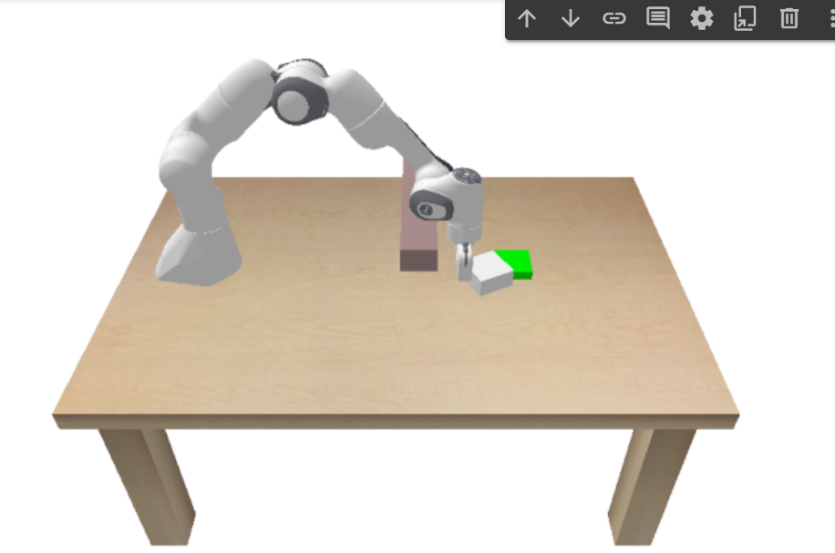

# Introduction
* Here is a PPO implementation to push an object to its goal location using model-free RL.
* I am still updating the README with more facts and figures, as I run more experiments on this.
* Stay tuned for more exciting results and conclusions.

# Result
* Here is a short video showing the result of pushing the block in presence of obstacle.

[)](https://drive.google.com/file/d/1yJnfZyi3Tnu4L2gI1VQCyh1NvjlR0ubk/view?usp=drive_link)
